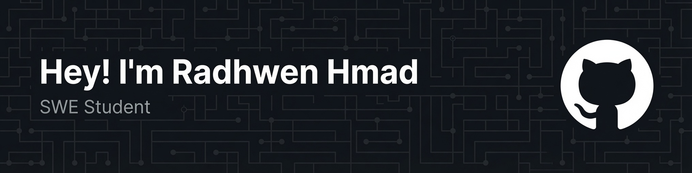

  

---

### 👨‍💻 About Me
- 🚀 **Software Engineering Student** passionate about programming and building applications.
- 🏆 Active **Competitive Programmer**, focusing on algorithms and data structures.
- ⚙️ Currently learning and exploring the **.NET Ecosystem**.
- 📚 Continuous learner, focused on writing clean and efficient code.

---

### 🛠️ Tech Stack & Tools

| Category | Technologies |
| :--- | :--- |
| **Languages** |      |
| **Databases & Tools** |   |

---

### 📊 GitHub Stats

  
  

---

---

### 🤝 Connect with me

  

